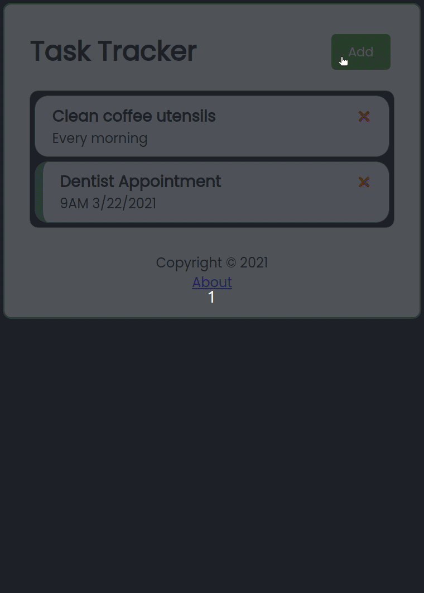

# Task Tracker

## What is this?

This task tracker software was built in an effort to better my React skills. This program lets you create a list of tasks and reminders; it uses json-server on the backend to persist those tasks. 

## How To Install

To use this code copy and paste the commands below:

  `git clone https://github.com/spaceC00kie/reactToDoList`

  `cd reactToDoList`

  `npm i`

  `npm run server`
  
  Open another window in the same directory and run:

  `npm start`

 Thank you for checking out my app :) 

   

     Credits
  

  
###### Thanks to Traversy Media for the [tutorial](https://youtu.be/w7ejDZ8SWv8) that helped me create this app.

###### Thank you to [Geek Technique](https://github.com/geektechniquestudios) for guidance as well!

